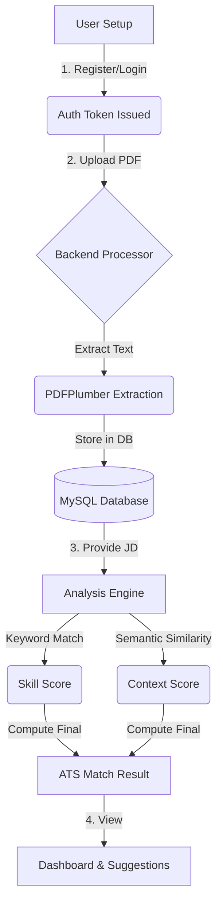

# 📄 ATS Resume Analyzer

An AI-powered Applicant Tracking System (ATS) that helps job seekers and recruiters evaluate resumes against specific job descriptions. By combining **Semantic Similarity** and **Technical Keyword Matching**, it provides a realistic "match score" along with actionable improvement suggestions.

---

## 🏗️ Project Overview

In today's job market, resumes are often filtered by automated systems before they ever reach a human recruiter. This project aims to bridge that gap by providing a tool that simulates the ATS evaluation process using modern NLP (Natural Language Processing) models.

### Key Context:
- **Full-Stack Implementation**: Separation of concerns between a React-based interactive UI and a high-performance Python backend.
- **AI-Driven Logic**: Uses the `all-MiniLM-L6-v2` transformer model for understanding the context of the resume beyond simple word matching.
- **Relational Integrity**: Maintains user profiles and resume histories using a relational database (MySQL).

---

## 💻 Tech Stack

### Frontend
- **Framework**: [React](https://react.dev/) + [Vite](https://vitejs.dev/)
- **Language**: [TypeScript](https://www.typescriptlang.org/)
- **Styling**: [Tailwind CSS](https://tailwindcss.com/) + [Shadcn UI](https://ui.shadcn.com/)
- **State Management**: [TanStack Query](https://tanstack.com/query/latest) (React Query)
- **Animations**: [Framer Motion](https://www.framer.com/motion/)
- **HTTP Client**: [Axios](https://axios-http.com/)

### Backend
- **Framework**: [FastAPI](https://fastapi.tiangolo.com/) (Python)
- **Database ORM**: [SQLAlchemy](https://www.sqlalchemy.org/)
- **AI/ML**: [Sentence-Transformers](https://www.sbert.net/), [Scikit-learn](https://scikit-learn.org/)
- **PDF Processing**: [PDFPlumber](https://github.com/jsvine/pdfplumber)
- **Authentication**: [JWT](https://jwt.io/) (JSON Web Tokens)

---

## 🔄 Project Flow

The following diagram illustrates the lifecycle of a resume analysis within the system:

---

## 📊 Database Schema

The system uses a MySQL relational structure to manage persistence:

### 1. `users` Table
Stores authentication details and profile information.
| Column | Type | Constraints |
| :--- | :--- | :--- |
| `id` | INT | Primary Key, Auto-increment |
| `name` | VARCHAR(100) | Not Null |
| `email` | VARCHAR(255) | Unique, Not Null |
| `password` | VARCHAR(255) | Hashed |
| `created_at` | TIMESTAMP | Default NOW() |

### 2. `resumes` Table
Tracks uploaded resumes and their extracted content.
| Column | Type | Constraints |
| :--- | :--- | :--- |
| `id` | INT | Primary Key, Auto-increment |
| `user_id` | INT | Foreign Key (users.id) |
| `file_path` | VARCHAR(500) | Not Null |
| `extracted_text` | LONGTEXT | Processed Content |
| `created_at` | TIMESTAMP | Default NOW() |

---

## 🧠 Analysis Logic

The match score is calculated using a weighted hybrid approach:

1.  **Semantic Similarity (50%)**: 
    Using `Sentence-Transformers`, the system converts both the resume and job description into high-dimensional vectors. It then calculates the **Cosine Similarity** to understand how well the candidate's background aligns with the job's context.
2.  **Keyword Matching (50%)**:
    The system checks for specific technical skills (Python, SQL, React, etc.) defined in a curated library. If a skill is mentioned in the JD but missing from the resume, it lowers the score and triggers a suggestion.

---

## ⚡ Features
- **Real-time Feedback**: Get instant scores after providing a job description.
- **Persistence**: Your previous resumes and analyses are saved to your profile.
- **Secure Auth**: Protect your personal career data with JWT-based sessions.
- **Clean UI**: A premium dashboard designed for clarity and usability.
